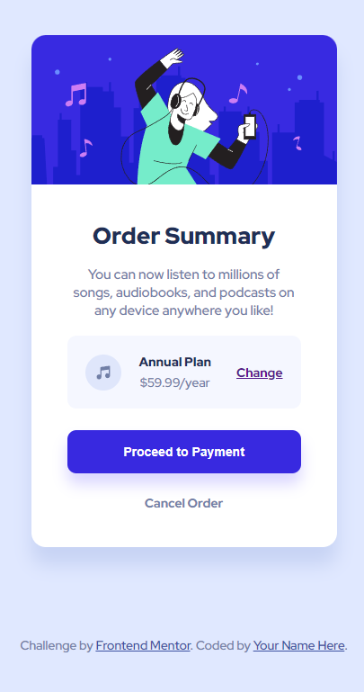

# Product Preview Card Component 👨‍💻

## Project Overview 🌟

This is a front-end coding challenge completed for [Frontend Mentor](https://www.frontendmentor.io). The challenge was to build a product preview card component and make it look as close to the provided design as possible.

## Technologies Used 💻

- HTML
- CSS

### The Challenge 📋

The challenge required the following:

- Create an order summary card.
- Implement hover states for interactive elements.

## Screenshots 📷

## Live Demo 🚀

You can view the live demo of the project [here](https://order-summary-component-005.netlify.app/).